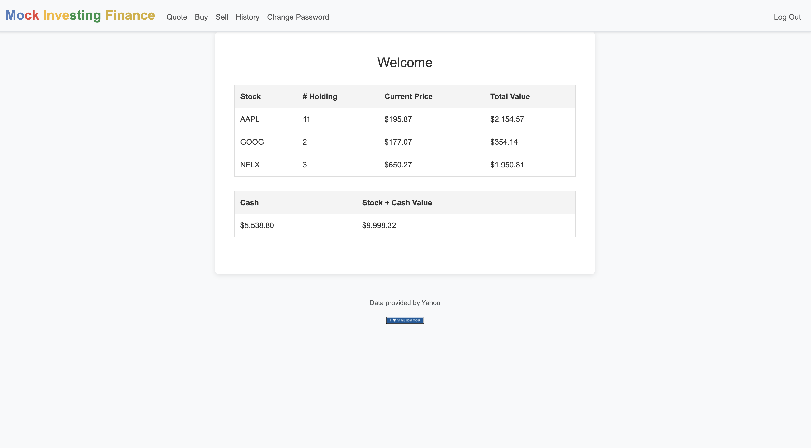
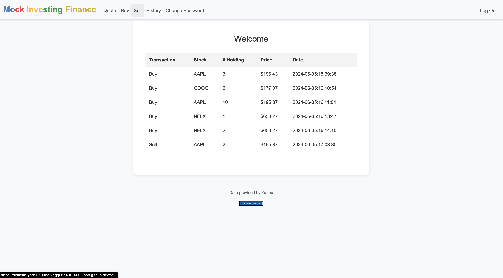

# 💰 Mock Investor 💰

**Do you want to get into investing? 💵** <br>
<br>
**Do you want to try your luck in the stock market? 📈** <br>
<br>
**Do you want to get rich? 🤑** <br>
<br>
**BUT.... are you scared of losing all your money!? 😰** <br>
<br>
**Well worry no further with Mock investor**, an all in one platform that allows you to see how you would do in the stock market! 
- You can create an account, and using $10,000 virtual USD, mock invest in any stocks you want!
- Simply type the ticker code and the amount you want to buy and it will be added to your account!
- You can see how you with a live portfolio that updates constantly so you can see how your stocks and portfolio are doing, and if your portolfio actualy went above $10,000!!!
- Have fun and explore, and get into investing! <br> <br>


### User Registration and Authentication

Users can create a new account by registering with a unique username and password. Registered users can log in to access their personalized dashboard.

### Stock Quote Lookup

Users can look up the latest stock prices by entering the stock symbol. The application uses the `lookup` function to fetch real-time data from a financial API.

### Buy Stocks

Users can purchase stocks by entering the stock symbol and the number of shares they want to buy. The application checks if the user has enough cash to make the purchase and updates their portfolio and cash balance accordingly.

### Sell Stocks

Users can sell stocks from their portfolio by specifying the stock symbol and the number of shares to sell. The application ensures the user has enough shares to sell and updates their portfolio and cash balance.

### View Portfolio

Users can view their current stock holdings, including the stock symbol, number of shares, current price, and total value of each holding. The total value of the portfolio, including available cash, is also displayed.

### View Transaction History

Users can view a detailed history of all their transactions, including buys and sells. Each entry includes the stock symbol, number of shares, price per share, and the date of the transaction.

### Change Password

Users can change their account password by entering their current password and the new password. The application verifies the current password and updates the password if the new password and confirmation match.



## Technologies Used

- Python
- Flask
- SQLite
- Bootstrap (for styling)

## Installation

1. Clone the repository:
    ```sh
    git clone https://github.com/yourusername/mock-investing-finance.git
    cd mock-investing-finance
    ```

2. Set up a virtual environment and install dependencies:
    ```sh
    python3 -m venv venv
    source venv/bin/activate
    pip install -r requirements.txt
    ```

3. Set up the database:
    ```sh
    export FLASK_APP=app.py
    flask db init
    flask db migrate -m "Initial migration."
    flask db upgrade
    ```

4. Run the application:
    ```sh
    flask run
    ```

5. Open your browser and navigate to `http://127.0.0.1:5000`.

### Routes

- `/`: Shows the user's stock portfolio.
- `/buy`: Allows the user to buy stocks.
- `/sell`: Allows the user to sell stocks.
- `/quote`: Allows the user to look up stock quotes.
- `/history`: Shows the user's transaction history.
- `/login`: Logs the user in.
- `/logout`: Logs the user out.
- `/register`: Registers a new user.
- `/change-password`: Allows the user to change their password.
